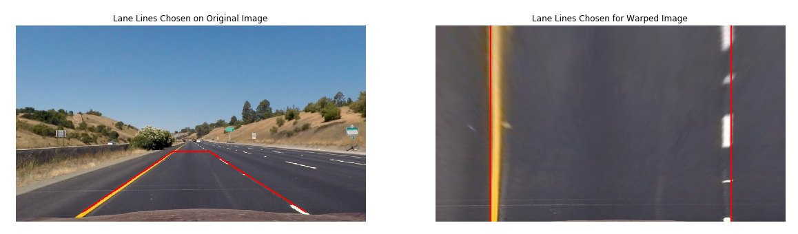

## **Advanced Lane Finding Project**

The goals / steps of this project are the following:

* Compute the camera calibration matrix and distortion coefficients given a set of chessboard images.
* Apply a distortion correction to raw images.
* Use color transforms, gradients, etc., to create a thresholded binary image.
* Apply a perspective transform to rectify binary image ("birds-eye view").
* Detect lane pixels and fit to find the lane boundary.
* Determine the curvature of the lane and vehicle position with respect to center.
* Warp the detected lane boundaries back onto the original image.
* Output visual display of the lane boundaries and numerical estimation of lane curvature and vehicle position.

## [Rubric Points](https://review.udacity.com/#!/rubrics/571/view) 

### Here I will consider the rubric points individually and describe how I addressed each point in my implementation.  

---

### 1. Camera Calibration
The code for this step is contained in the first code cell of the IPython Notebook located in "./examples/example.ipynb" (or in lines # through # of the file called `some_file.py`).  

To calibrate the camera, the calibration images found at [calib_imgs](./calib_imgs) folder, representing a 9x6 Chessboard:
*The following procedures acquired the calibration matrix* ``mtx`` *which was used to undistort any image took by the car's camera.*
1. Determining Object Points of (x, y, z) coordinates of the chessboard corners in real world.
    * The chessboard is assumed to be fixed on the (x, y) plane, hence z = 0
    * The same Object Points were assigned for each calibration image, thus `objpoints` is just a replicated array of `objp`
2. Converting each image to grayscale, to prepare it for Corner Detection.    
3. Using OpenCV function `cv2.findChessboardCorners()` to detect corners on the 9x6 chessboard
4. Each time all chessboard corners are successfully detected:
    1. Append the detected corners to `imgpoints`
    2. Append the a replica of `objp` to `objpoints`
5. Use OpenCV function `cv2.calibrateCamera()` to acquire the calibration matrix `mtx` and distortion coefficients `dist`
6. Apply the acquired distortion correction parameters to input images using the `cv2.undistort()` function

The following figure represents the undistortion applied to 2 chessboard images:
* Row1: The Chessboard's corners were detected, drawn onto the image, and is then undistorted.
* Row2: The Chessboard's corners aren't all included in the image, hence it's corners weren't detected, nonetheless was undistorted using `mtx` and `dist`

<p align="center">

</p>

### 2. Transformation Matrix
The code for this step is contained in the first code cell of the IPython Notebook located in "./examples/example.ipynb" (or in lines # through # of the file called `some_file.py`). 

To accurately detect lane line's we need to look at the road with a **Bird's Eye View**, through applying a perspective transform to the image, to view the lanes as parallel lines and have the ability to detect and calculate curvature.

*The following procedures acquired the transformation matrix* `M` *&* `Minv` *which was used to warp any image to a Bird's Eye Perspective, and back to the original perspective later.*
The function `transform_matrix()` is used to execute the following steps:
1. Source Points `src` were chosen from a sample image, outlining the lanes in this image.
2. Destination Points `dst` were determined as an erect rectangle, to transfrom `src` onto `dst` achieving the bird's eye perspective.
* Source and Destination Points are Calculated Below:
```python
## Source Points
## Start: Bottom Left Corner -- ClockWise Rotation
src = np.float32([[244.515,685.472],
                  [575.507,462.495],
                  [706.532,462.456],
                  [1061.62,685.42]])

offset = 200

dst = np.float32([[offset,img.shape[0]],
                  [offset,0],
                  [img.shape[1]-offset,0],
                  [img.shape[1]-offset,img.shape[0]]])
```
This resulted in the following source and destination points:

| Source        | Destination   | 
|:-------------:|:-------------:| 
| 244.5,685.5     | 200, 720        | 
| 575.5,462.5     | 200, 0      |
| 706.5,462.5     | 1080, 0      |
| 1061.6,685.4      | 1080, 720        |

3. Using OpenCV function `cv2.getPerspectiveTransform` we acquire transformation matrix `M` to warp images into bird's eye view.
4. Through flipping the `src` and `dst` points in `cv2.getPerspectiveTransform` we get the tranformation matrix `Minv` to unwrap the wrapped images back to it's original state.
* These images represent the `src` points on the Original Image and `dst` points on Warped Image
<p align="center">

</p>

### Single Image Processing Pipeline 

#### 1. Provide an example of a distortion-corrected image.

To demonstrate this step, I will describe how I apply the distortion correction to one of the test images like this one:
![alt text][image2]

#### 2. Describe how (and identify where in your code) you used color transforms, gradients or other methods to create a thresholded binary image.  Provide an example of a binary image result.

I used a combination of color and gradient thresholds to generate a binary image (thresholding steps at lines # through # in `another_file.py`).  Here's an example of my output for this step.  (note: this is not actually from one of the test images)

![alt text][image3]

#### 3. Describe how (and identify where in your code) you performed a perspective transform and provide an example of a transformed image.

The code for my perspective transform includes a function called `warper()`, which appears in lines 1 through 8 in the file `example.py` (output_images/examples/example.py) (or, for example, in the 3rd code cell of the IPython notebook).  The `warper()` function takes as inputs an image (`img`), as well as source (`src`) and destination (`dst`) points.  I chose the hardcode the source and destination points in the following manner:


I verified that my perspective transform was working as expected by drawing the `src` and `dst` points onto a test image and its warped counterpart to verify that the lines appear parallel in the warped image.

![alt text][image4]

#### 4. Describe how (and identify where in your code) you identified lane-line pixels and fit their positions with a polynomial?

Then I did some other stuff and fit my lane lines with a 2nd order polynomial kinda like this:

![alt text][image5]

#### 5. Describe how (and identify where in your code) you calculated the radius of curvature of the lane and the position of the vehicle with respect to center.

I did this in lines # through # in my code in `my_other_file.py`

#### 6. Provide an example image of your result plotted back down onto the road such that the lane area is identified clearly.

I implemented this step in lines # through # in my code in `yet_another_file.py` in the function `map_lane()`.  Here is an example of my result on a test image:

![alt text][image6]

---

### Pipeline (video)

#### 1. Provide a link to your final video output.  Your pipeline should perform reasonably well on the entire project video (wobbly lines are ok but no catastrophic failures that would cause the car to drive off the road!).

Here's a [link to my video result](./project_video.mp4)

---

### Discussion

#### 1. Briefly discuss any problems / issues you faced in your implementation of this project.  Where will your pipeline likely fail?  What could you do to make it more robust?

Here I'll talk about the approach I took, what techniques I used, what worked and why, where the pipeline might fail and how I might improve it if I were going to pursue this project further.  
