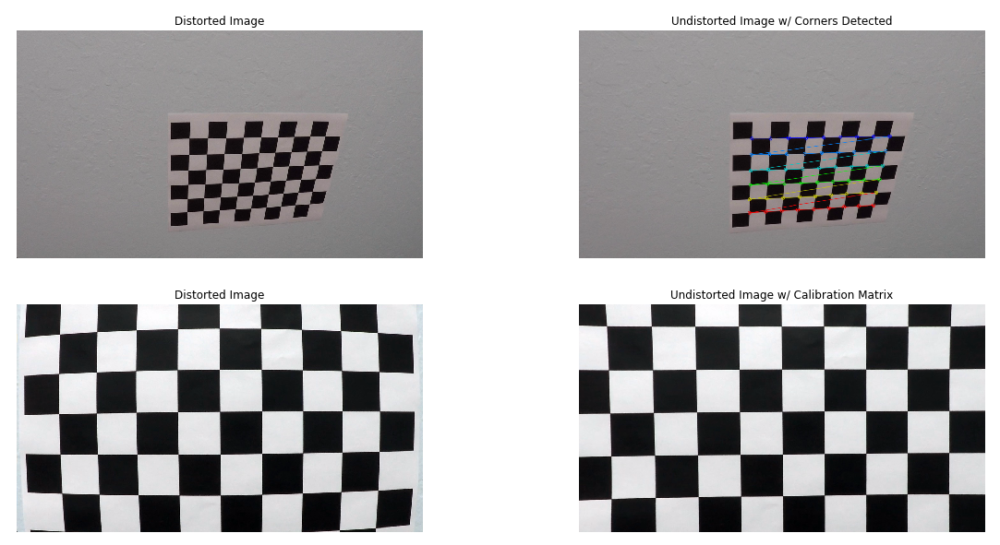

## **Advanced Lane Finding Project**

The goals / steps of this project are the following:

* Compute the camera calibration matrix and distortion coefficients given a set of chessboard images.
* Apply a distortion correction to raw images.
* Use color transforms, gradients, etc., to create a thresholded binary image.
* Apply a perspective transform to rectify binary image ("birds-eye view").
* Detect lane pixels and fit to find the lane boundary.
* Determine the curvature of the lane and vehicle position with respect to center.
* Warp the detected lane boundaries back onto the original image.
* Output visual display of the lane boundaries and numerical estimation of lane curvature and vehicle position.

---
## Matrices Calculation 
### 1. Camera Calibration
The code for this step is contained in the first code cell of the IPython Notebook located in "./examples/example.ipynb" (or in lines # through # of the file called `some_file.py`).  

To calibrate the camera, the calibration images found at [calib_imgs](./calib_imgs) folder, representing a 9x6 Chessboard:
*The following procedures acquired the calibration matrix* ``mtx`` *which was used to undistort any image took by the car's camera.*
* The function `calibrate()` is used to execute the following steps:
1. Determining Object Points of (x, y, z) coordinates of the chessboard corners in real world.
    * The chessboard is assumed to be fixed on the (x, y) plane, hence z = 0
    * The same Object Points were assigned for each calibration image, thus `objpoints` is just a replicated array of `objp`
2. Converting each image to grayscale, to prepare it for Corner Detection.    
3. Using OpenCV function `cv2.findChessboardCorners()` to detect corners on the 9x6 chessboard
4. Each time all chessboard corners are successfully detected:
    1. Append the detected corners to `imgpoints`
    2. Append the a replica of `objp` to `objpoints`
5. Use OpenCV function `cv2.calibrateCamera()` to acquire the calibration matrix `mtx` and distortion coefficients `dist`
6. Apply the acquired distortion correction parameters to input images using the `cv2.undistort()` function

The following figure represents the undistortion applied to 2 chessboard images:
* Row1: The Chessboard's corners were detected, drawn onto the image, and is then undistorted.
* Row2: The Chessboard's corners aren't all included in the image, hence it's corners weren't detected, nonetheless was undistorted using `mtx` and `dist`

<p align="center">

</p>

### 2. Transformation Matrix
The code for this step is contained in the first code cell of the IPython Notebook located in "./examples/example.ipynb" (or in lines # through # of the file called `some_file.py`). 

To accurately detect lane line's we need to look at the road with a **Bird's Eye View**, through applying a perspective transform to the image, to view the lanes as parallel lines and have the ability to detect and calculate curvature.

*The following procedures acquired the transformation matrix* `M` *&* `Minv` *which was used to warp any image to a Bird's Eye Perspective, and back to the original perspective later.*
The function `transform_matrix()` is used to execute the following steps:
1. Source Points `src` were chosen from a sample image, outlining the lanes in this image.
2. Destination Points `dst` were determined as an erect rectangle, to transfrom `src` onto `dst` achieving the bird's eye perspective.
* Source and Destination Points are Calculated Below:
```python
## Source Points
## Start: Bottom Left Corner -- ClockWise Rotation
src = np.float32([[244.515,685.472],
                  [575.507,462.495],
                  [706.532,462.456],
                  [1061.62,685.42]])

offset = 200

dst = np.float32([[offset,img.shape[0]],
                  [offset,0],
                  [img.shape[1]-offset,0],
                  [img.shape[1]-offset,img.shape[0]]])
```
This resulted in the following source and destination points:

| Source        | Destination   | 
|:-------------:|:-------------:| 
| 244.5 , 685.5     | 200 , 720        | 
| 575.5 , 462.5     | 200 , 0      |
| 706.5 , 462.5     | 1080 , 0      |
| 1061.6 , 685.4      | 1080 , 720        |

3. Using OpenCV function `cv2.getPerspectiveTransform` we acquire transformation matrix `M` to warp images into bird's eye view.
4. Through flipping the `src` and `dst` points in `cv2.getPerspectiveTransform` we get the tranformation matrix `Minv` to unwrap the wrapped images back to it's original state.
* The perspective transform matrix was tested by drawing the `src` and `dst` points onto a test image and its warped counterpart to verify that the lines appear parallel in the warped image:
<p align="center">

</p>

---
## Single Image Processing Pipeline 
*The code for this step is contained in the first code cell of the IPython Notebook located in "./examples/example.ipynb" (or in lines # through # of the file called `some_file.py`).*

This pipeline `process_img()` is set with threshholds to detect lanes within an image in the RGB color space. If the image was read with `cv2.imread()`, or is in the BGR color space, it is transformed to RGB using the BGR parameter. `process_img(BGR=True)`
### 1. Remove Image Distortion `cv2.undistort()`

Using OpenCV function `cv2.undistort()`, along with the calculated calibration matrix `mtx`, and distortion parameters `dist`. Input images into the pipeline are undistorted:
<p align="center">

</p>

### 2. Threshholded Binary Image

#### To detect the lane lines in an image, several threshholds were applied separately on the image:
##### 1. Color Threshholds:
##### *The following threshholds consider only RGB input images*
Multiple experiments with all the components within different color spaces were applied to different images under changeable lighting and shadowing, including: HSV, HLS, LUV, LAB, YUV, RGB and GrayScale. These threshholds were implemented using the `color_threshhold()` function. *The following proved to be most efficient*
1. LUV Color Space: The L Component proved to be most efficient in detecting the right lane 
   * @threshhold: 210 <= L < 255
2. LAB Color Space: The B Component proved to be most efficient in detecting the left lane
   * @threshhold: 150 <= B < 255
> Since, both techniques detects separate lanes, and are set at appropriate threshholds to produce minimal noise.
>> Therefore, both color components are executed and combined using the OR `|` operator to achieve a complete layover of both binary images.
<p align="center">

</p>

##### 2. Gradient Threshholds:
The Sobel Operator was executed with different calculations to get the gradient in the X and Y direction; `sobel_abs()`, calculating the magnitute of the X and Y outputs; `sobel_mag()`, and the direction of the gradients; `sobel_dir()`. These gradients were introduced to different images, within several threshholds, and these outcomes were concluded:
1. The Gradient in the X direction was the most efficient in calculating the vertical lines, but it suffered a lot of noise under shadows
   * @threshhold 20 <= sobelX < 255, 3x3 kernel
2. The Gradient in the Y direction detected the lanes too (*Specially the right lane*) but also suffered a lot of noise.
   * @threshhold 30 <= sobelY < 255, 3x3 kernel 
> Since, The noises suffered in the X and Y directions were different yet both detected the lanes fairly.
>> Therefore, both gradients were executed and combined using the AND `&` operator to remove the noise from both and still detect the lanes, assisting the color threshholding techniques towards an accurate detection.
<p align="center">

</p>

#### Results:
Using the discussed color and gradient thresholds a binary image was created using the OR `|` operator, creating the highest detection of lane lines achieved (thresholding steps at lines # through # in `another_file.py`). 

* The following image, represents the combined result of the color and gradient threshholding techniques.
* *Note: It's clear how the AND `&` operator fairly removes the noise in the Sobel Threshholds Combined image,*
<p align="center">

</p>

### 3. Perspective Transform: Bird's Eye View
After threshholding the image into a binary image, the image is transformed using the transformation matrix `M` (calculated previously with `transform_matrix()`) and OpenCV function `cv2.warpPerspective()`, the binary image's perspective is transformed to bird's eye:
<p align="center">

</p>

### 4. Lane Detection: Convolutions and Sliding Windows
*The code for this step is contained in the first code cell of the IPython Notebook located in "./examples/example.ipynb" (or in lines # through # of the file called `some_file.py`).*

#### 1. `detect_lanes()`
The lane lines in the warped image were detected using the `detect_lanes()` function, which summarizes into the following steps:
1. Determining the lane position using the histogram calculated over the lower `height_ratio=3/4` of the image's height.
   * Left lane is searched for in the image's left half (upto the image's midpoint `img_width//2`), and the right lane is assumed to be within the right half
2. Divide the image into layers of height `window_height=80`, and loop over these layers detecting the nonzero points for both the left and right lane seperately
3. The centroids for each layer is determined upon each layer's maximum points detected, and is used as a staring point for the following layer within a certain `margin`
   * If the number of points detected is less than `minpx=50` the centroids aren't updated to avoid deviating the lane for outliers
4. The left and right lanes' nonzero indeces for points detected are appended to `L_points` and `R_points` and are used to get the X and Y dimensions of each point for both lanes:
   * Left Lane: `XL_lane` and `YL_lane`
   * Right Lane: `XR_lane` and `YR_lane`
5. The X and Y points are used with Numpy's function ``np.polyfit()`` to fit these points to a polynomial of the 2nd degree, acquiring: `left_fit` and `right_fit`: [A,B,C] - which are the 2nd degree curve coefficients. 

#### 2. `draw_curve()`
Using the `left_fit` and `right_fit` for both lanes, the function `draw_curve()` applies the following equation calculating `x` position of the fitted curve for each point in the image's height `y`. 
```python 
y = np.linspace(0, img_height-1, img_height)
fit = left_fit or right_fit
```
```math
A = fit[0]
B = fit[1]
C = fit[2]
x = f(y) = Ay^2 + By + C
``` 
The following image represents a warped binary image with the lanes detected, and the sliding windows projected onto the image.
<p align="center">

</p>

#### 3. Radius of Curvature Calculation `realworld_rad()`
The `realworld_rad()` function is embedded with the `detect_lanes()` function, and calculates the radius of curvature in real world dimensions, using the following pixel to meters conversions:
* `xm_per_pix = xpx = 3.7/880` meters/pixel
* `ym_per_pix = ypx = 30/720` meters/pixel
The function uses the X and Y points of both lanes to fit curves in real world dimensions and calculates its curvature at the front:
```python
fit_real = leftfit_real or rightfit_real
y_eval = img_height - 1 #Calculating the curvature at the car
```
```math
A = fit_real[0]
B = fit_real[1]
curvature = (1 + ( 2A(y_eval*ym_per_pix) + B )^2 )^1.5 / |2A|
```
* *The radius of curvature viewed in the output image, is the average of the left and right lanes' curvatures.*

#### 4. Car Offset from Lane Center
Further more using the `xm_per_pix` within the `process_img()` pipeline. The car's offset from the lane center is calculated:
1. From the car's hood up to the first fifth of the image, the left and right curves' points are averaged seperately.
2. Both averages mean is calculated to get the lane's midpoint close to the car.
3. The center of the car is assumed to be the camera's position which equals the center of the image at `img_width//2=640`
4. The lane's midpoint is subtracted from the car's center and multiplied by `xm_per_pix`:
```python
offset = (img.shape[1]//2 - midpoint) * xpx
```
   * If the car's center is to the right of the lane's center: the offset is positive, and viceversa.
   
#### 5. `draw_road()` and `cv2.putText()`
The `draw_road()` function executes the final touch on the detected lanes: 
1. Unwarps the detected lanes using the inverse transformation matrix `Minv`, returning the lanes to their original state.
2. Projects a green polygon, with the help of `cv2.fillPoly()` onto the original image representing the entire lane; with the left lane highlighted in blue, and right lane in red.
3. Finally, `cv2.putText()` places the curvature and offset calculated at the top left corner of the image.

### 5. Single Image Processing: Pipeline Output
<p align="center">

</p>

---
## Video Processing Pipeline
*The code for this step is contained in the first code cell of the IPython Notebook located in "./examples/example.ipynb" (or in lines # through # of the file called `some_file.py`).*

This pipeline `process_vid()` is set with threshholds to detect lanes within an image in the RGB color space. The video is processed using MoviePy library `moviepy.editor`, which reads and writes the video in the same color space.
```python
clip = VideoFileClip('./project_video.mp4')
clip_output = './project_output.mp4'
format_clip = clip.fl_image(process_vid)
%time format_clip.write_videofile(clip_output, audio=False)
```

*The video pipeline `process_vid()` follows the exact same steps as the single image processing pipeline `process_img()`.*

#### However, the video pipeline reimplements `process_img()` since the class `Line` is being used. This method is being implemented in `process_vid()` pipeline for the following reasons:
1. Smoothing out the lane lines detected and avoiding any vigorous jumps between frames.
2. Applying a sanity check per frame to make sure the detected lanes make sense, the sanity checks applied include:
   * Asserting that the left and right lanes detected have approximately parallel tangents at the middle of their curves.
   * Asserting that the left and right lanes detected are approximately equidistant all along the image's height.

*The pipeline starts applying the `detect_lanes()` function for the first 3 frames and adds them to a queue.*

#### If the lanes detected passes the sanity checks, the lanes are considered legible `road.detected=True`:
1. The detected lanes are projected onto the image with a weight of `fltr=0.6` to an average of the past `n=5` detected lanes
2. If the queue of detected lanes reaches its set capacity of `n=5`, it dequeues its first entry, and enqueues the lanes detected.
3. The lanes radius of curvature and offset are calculated and displayed onto the image.
4. The next frame undergoes the `look_ahead()` function which instead of processing a blind search on the whole image, it searches the area surrounding the previously detected lanes with a `margin=20`, which speeds up the video processing and creates a more robust output.

#### If the lanes detected fails the sanity checks, the lanes are considered illegible `road.detected=False`:
* The detected lanes are neglected, and instead an average of the past `n=5` lanes is projected onto the video avoiding any vigorous or incorrect detections.
* No curvature or offset calculations are executed, hence the last frame's calculated curvature and offset are displayed instead.
* The first entry of the detected lanes queue is dequeued decrease the first frames bias from the recent misdetected frames
* The lane detection count is reset to 0, and the next following 3 frames undergo blind searches with the `detect_lanes()` function, to make sure the following detections are more accurate.
  
#### Video Processing: Pipeline Output

Here's my pipeline's [output video](./project_output.mp4)
Moreover, a [youtube link](https://youtu.be/B-C9LrFamvI) to watch the video online.

---

## Discussion
#### Issues faced throughout the implementation of the project
1. The threshholds chosen might overfit to certain conditions:
   * The sobel gradient would ruin the detection if any kind of noise was introduced into the lane, like any consistent variance in color within the lane, or a nearby edge, would be detected as an edge, and might cause a faulty detection of the lane lines.

2. The shadowing and excessive brightness drastically affects the detection, and might cause distorted detections.

3. The transformation matrices calculated isn't accurate enough, and suffers a human error, unlike the detection of chessboard corners.

4. The calibration images provided, aren't enough to calibrate the camera. With more than the provided calibration images of the chessboard, the calibration matrix and distortion parameters would be more accurate.

5. The video processing takes a lot of time to process the video, which would be a problem to use in real_time, so buffers and other techniques could be used to speed up the process.

6. Outlier rejection techniques should be used to avoid outliers affecting the fitted curve to the lanes.
